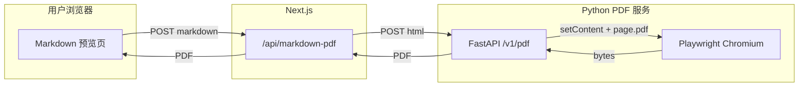

# Markdown 导出 PDF：独立 Python 后端 + Playwright（方案 A）

本文档将 **独立 Python 服务**、**Headless Chromium（Playwright）**、**与 Next 预览一致的 WYSIWYG（方案 A）**、**Pydantic 校验**、**Gunicorn + Uvicorn Worker 生产部署** 以及 **高性能要点** 一次性落盘，作为实现与评审的单一事实来源（后续代码应对齐本文，若变更请同步改文档）。

---

## 1. 目标与非目标

### 1.1 目标

- 用户点击导出后得到 **PDF 文件**。
- **版式与站点 Markdown 预览一致**（同一套 HTML 结构与同一套样式语义，允许分页与断页位置与滚动预览不同）。
- 后端 **独立于 Next.js**，技术栈为 **Python**，PDF 由 **Playwright 驱动 Chromium** 生成。
- 生产环境使用 **Gunicorn + Uvicorn Worker**，配置可水平扩展与资源可控。
- 全流程考虑 **吞吐、延迟、资源占用** 与 **滥用防护**。

### 1.2 非目标

- 不在本文档中规定 Next 侧按钮/UI 的最终交互细节（实现时对接即可）。
- 不要求 PDF 与「屏幕截图」逐像素一致（矢量排版与分页规则由 Chromium 决定）。

---

## 2. 核心决策：方案 A（前端出 HTML，后端只负责 PDF）

### 2.1 为什么选方案 A

预览链路为：`react-markdown` + `remark-gfm` + 自定义 `components`（见 `web/components/markdown-preview-editor.tsx`）。若在 Python 内再用另一套 Markdown 解析器生成 HTML，**GFM 细节、安全策略、组件行为** 极易分叉，WYSIWYG 难以保证。

**方案 A**：由 **Next（浏览器或 Node SSR）** 使用 **与预览完全相同的配置** 将当前文档渲染为 **静态 HTML 片段**，再 POST 给 Python；Python **只做**：

1. 将片段嵌入完整 HTML 文档（`DOCTYPE`、`meta`、内联 CSS 等）；
2. Playwright `setContent` → `page.pdf()`；
3. 返回 `application/pdf`。

### 2.2 前端契约（逻辑结构）

请求体（JSON）建议字段：

| 字段 | 类型 | 说明 |
|------|------|------|
| `html` | `string` | 已渲染好的主体 HTML，外层建议带与预览一致的根类名，例如 `markdown-preview-root markdown-preview-wide max-w-none` |
| `color_mode` | `"light" \| "dark"` | 与预览 `data-color-mode` 一致 |
| `filename` | `string`（可选） | 下载文件名，仅允许安全字符，服务端需再校验 |
| `paper` | `string`（可选） | 默认 `A4`，可扩展 `Letter` |
| `print_background` | `bool`（可选） | 默认 `true`，与代码块/表头背景一致 |

**禁止**（在方案 A 下）：依赖 Python 解析 Markdown 作为唯一数据源来追求与预览一致（若将来提供「仅 Markdown」接口，须在文档中明确为 **非 WYSIWYG 保证** 模式）。

---

## 3. 系统架构



### 3.1 网络与网关

- **推荐**：反向代理将 **`/api/pdf` 或 `/v1/pdf`** 转发到内网 PDF 服务，浏览器仍访问 **同源**，避免 CORS 与 Cookie 复杂化。
- **备选**：独立子域 + CORS；需显式配置允许源与凭证策略。
- **仓库默认**：根目录 **`docker-compose.yml`** 将 `web` 与 `markdown-pdf` 置于同一 Compose 网络，Next 使用 `PDF_SERVICE_URL=http://markdown-pdf:8000`；生产仅需该文件 + `.env` + 已拉取镜像，无需挂载源码（见 `web/docs/production-deployment.zh-CN.md`）。

### 3.2 与现有仓库的关系

- 当前 `web` 为 **Next standalone**（`Dockerfile` 基于 **Alpine**），**不强制**在 Next 镜像内安装 Chromium；PDF 能力放在 **独立 Python 镜像（建议 Debian bookworm-slim）**。
- 现有 `web/app/api/merge-pdf` 仍为 Node Route Handler；Markdown PDF **新增** Python 服务，二者可并存，后续若统一网关规则再在文档中收敛。

### 3.3 仓库中的实际数据流（已实现）

- 浏览器 `POST /api/markdown-pdf`，JSON：`markdown`、`color_mode`、`filename`（见 `web/app/api/markdown-pdf/route.ts`）。
- Next **在 Route Handler 内**用 `remark-parse` + `remark-gfm` + `remark-rehype` + **`rehype-prism-plus`**（与 `@uiw/react-md-editor` 预览一致）+ `rehype-stringify` 生成 HTML（`web/lib/markdown-to-preview-html.ts`），外链规则与预览组件 `markdownPreviewComponents` 对齐；代码块带 Prism `token` 类名，PDF 侧 `markdown-export.css` 内嵌 GitHub Pretty Lights 变量与 `@uiw/react-markdown-preview` 对齐。说明：Next 16 的 App Router **禁止**在 Route Handler 中直接使用 `react-dom/server`，故采用 remark/rehype 管线代替 `renderToStaticMarkup`。
- Next 将 `{ html, color_mode, ... }` 转发至 Python `POST /v1/pdf`（`services/markdown-pdf/app/main.py`）。
- Python：`nh3` 消毒（`link_rel=None` 以保留 `<a rel>`）→ 拼完整文档 + 内联 `assets/markdown-export.css` → Playwright `page.pdf()`。

---

## 4. Python 技术栈与依赖角色

| 组件 | 用途 |
|------|------|
| **FastAPI** | HTTP API、依赖注入、OpenAPI |
| **Pydantic v2** | 请求/响应模型、字段约束、枚举、自定义校验（文件名白名单、长度上限等） |
| **Uvicorn** | ASGI 服务器（开发直连；生产作为 Gunicorn worker 类使用） |
| **Gunicorn** | 多进程 Master，拉起多个 Uvicorn Worker，提升多核利用率与稳定性 |
| **Playwright（Python）** | 启动 Chromium，`set_content` + `page.pdf()` |

实现目录建议：`services/markdown-pdf/`（与 `web/` 平级），便于单独构建镜像与 CI。

---

## 5. API 设计（Pydantic 层面要求）

### 5.1 路由建议

- `POST /v1/pdf`：生成 PDF，返回二进制。
- `GET /healthz`：进程存活（可选 `GET /readyz` 检查 Chromium 是否已启动，见运维节）。

### 5.2 请求模型（概念）

- `html`：`str`，`max_length` 与业务对齐（例如 512_000～2_000_000 字符量级，按产品调整）。
- `color_mode`：Literal `"light", "dark"`。
- `filename`：可选，默认 `export.pdf`；正则限制为 `[a-zA-Z0-9._-]+`，防路径穿越。
- `paper`：可选枚举 `A4`、`Letter`。
- `print_background`：`bool`，默认 `True`。
- `font_override_css`：可选字符串，默认空；由 Next 根据服务端环境变量 **`MARKDOWN_EXPORT_BASE_FONT_PX`**（整数 px，12–22，未设置则默认 14）生成，插在基础 `markdown-export.css` 之后，与 HTML 导出字号一致（`max_length` 需限制，如 16KiB）。

### 5.3 响应与错误

- 成功：`200`，`Content-Type: application/pdf`，`Content-Disposition: attachment; filename="..."`，`Cache-Control: no-store`。
- 客户端错误：`422`（Pydantic 校验失败）或 `400`（业务规则）；**JSON** `{"detail": ...}`。
- 超时/生成失败：`504` 或 `500`，JSON，**勿**返回 HTML 错误页。

### 5.4 HTML 消毒（必须）

即使 HTML 来自自有前端，仍须 **服务端白名单消毒**（例如 **nh3** 或 **bleach**），防止被篡改请求体注入脚本或异常标签。消毒规则需 **允许** 预览用到的标签/属性（`class`、`href`、`rel`、`target`、`colspan` 等），**禁止** `script`、`on*` 事件、`javascript:` 等。

---

## 6. Playwright 与高性能实现要点

### 6.1 进程模型与 Gunicorn 的注意事项

- Gunicorn 默认 **多 Worker = 多进程**。每个 Worker 进程内应 **各自** 维护 **一个 Chromium 实例（或 Browser）**，在 **Worker 启动钩子** 中 `launch`，在进程退出时 `stop`。
- **不要使用 `gunicorn --preload`** 与「在 import 时全局启动浏览器」组合后在父进程打开浏览器再 fork——易导致文件描述符/子进程状态异常。推荐：**每个 Worker 在 lifespan/startup 事件中启动 Playwright**。

### 6.2 每请求路径（推荐）

在每个 Worker 内：

1. 复用 **Browser**（重量级，进程级单例）。
2. 每请求 **`browser.new_context()`** → **`new_page()`** → `set_content` → `page.pdf()` → **`context.close()`**（或 `page.close()` + `context.close()`）。

避免每请求 `chromium.launch()`（冷启动成本高一个数量级以上）。

### 6.3 异步与并发控制

- FastAPI 路由使用 **`async def`**，内部通过 **`asyncio.to_thread`** 调用同步 Playwright API，或采用 Playwright **async API**（需保证与 Gunicorn worker 事件循环模型一致；若使用 sync Playwright，务必不要在事件循环里阻塞过久——用线程池隔离）。
- 在每个 Worker 内使用 **`asyncio.Semaphore`**（或等价）限制 **同时进行 PDF 渲染的请求数**（例如每 Worker 同时最多 1～2 个 Chromium 页面任务），避免内存尖峰与 OOM。

### 6.4 超时

- `set_content` 与 `page.pdf` 均设 **硬超时**（建议可配置，默认 25～30s），超时返回 `504` 或 `422`（按产品语义）。

### 6.5 资源与横向扩展

- 单 Pod/单机的 Worker 数：`workers ≈ (CPU 核心数 × 2)` 的上界需用 **内存** 校正（每个 Chromium 约数百 MB 量级，视并发与页面复杂度而定）。**以压测为准**，宁少勿滥。
- 水平扩展：多实例 + 网关限流；**会话粘滞非必须**（无状态服务）。

### 6.6 外网访问与静态资源

- 默认策略：**阻断** 对任意公网 URL 的自动拉取，或仅允许 `data:` 与明确配置的静态域名；图片未内联时 PDF 可能缺图，与产品约定一致即可。
- 若预览大量依赖外链图，可选：前端导出前将图转 **data URL**（注意体积），或放行白名单 CDN 域。

---

## 7. CSS 与字体（WYSIWYG 关键）

- Python 组装的完整 HTML 文档须在 `<head>` 中携带 **与预览语义一致** 的样式：
  - **推荐**：在 `web` 构建链路中生成 **`markdown-export.css`**（从现有 `globals.css` / Tailwind 中抽取 `.markdown-preview-root` 及其依赖变量与字体），作为静态文件 **嵌入镜像** 或由 PDF 服务读取。
- `<html data-color-mode="{color_mode}">` 与预览根一致。
- 指定与站点一致的 **`font-family`**（含等宽字体用于代码块）；中文场景确保 Chromium 镜像内安装 **Noto CJK** 等字体包，避免豆腐块。

---

## 8. 生产部署：Gunicorn + Uvicorn Worker

### 8.1 启动命令（示例）

```bash
gunicorn app.main:app \
  -k uvicorn.workers.UvicornWorker \
  -w "${WEB_CONCURRENCY:-4}" \
  -b 0.0.0.0:8000 \
  --timeout 120 \
  --graceful-timeout 30 \
  --access-logfile - \
  --error-logfile -
```

说明：

- `-k uvicorn.workers.UvicornWorker`：生产级 ASGI worker。
- `--timeout`：应大于单次 PDF 生成的最坏耗时（含排队等待若放在同步 worker 内）；若采用异步 + 内部 semaphore，仍以端到端 SLA 校准。
- Worker 数通过环境变量 **`WEB_CONCURRENCY`** 注入，便于 K8s/Docker 按 CPU request 调整。

### 8.2 开发环境

```bash
uvicorn app.main:app --reload --host 0.0.0.0 --port 8000
```

### 8.3 Docker 镜像要点

- 基础镜像：**`python:3.12-slim-bookworm`**（或等价 Debian slim），便于安装 Chromium 系统依赖。
- 构建步骤：`pip install -r requirements.txt` 后执行 **`playwright install --with-deps chromium`**（或官方文档推荐的 apt + `playwright install chromium` 组合）。
- **非 root** 用户运行（`USER app`），与健康检查、只读根文件系统策略兼容。

---

## 9. 安全与合规清单

- 请求体大小限制（反向代理 + FastAPI/Starlette 配置）。
- Pydantic 字段长度与枚举校验。
- HTML 白名单消毒。
- 限流（网关或应用内 token bucket）。
- 内网部署 + `X-Internal-Token`（可选）防止公网直连滥用。
- 日志中 **不记录** 完整 `html`（仅记录 hash/长度与 request id）。

---

## 10. Next.js 侧对接要点（实现阶段）

1. 抽取 **与 `MarkdownPreviewEditor` 相同** 的 `remarkPlugins` / `components` / 根 `className` / `data-color-mode`，生成 **静态 HTML 字符串**（需注意仅使用可 SSR 的组件子集，避免浏览器专有 API）。
2. 导出按钮：`fetch` POST → `blob()` → 触发下载；展示 loading 与错误提示。
3. 通过网关同源转发到 Python，或配置 `PDF_SERVICE_URL` 由 Next BFF 转发（避免浏览器暴露内网地址）。

---

## 11. 测试与验收

- 黄金样例：表格、任务列表、代码块、外链/内联图片、`javascript:` 链接应被剔除（与预览组件行为一致）。
- 浅色/深色各导出一份，检查背景与代码块。
- 压测：固定并发下 P95 延迟、错误率、内存曲线。
- 混沌：Chromium 崩溃后 Worker 能否在下次请求或健康检查中恢复（可实现 `browser` 懒加载 + 连接失败重试）。

---

## 12. 文档与代码同步约定

- 本文路径：`docs/5-Markdown导出PDF-Python-Playwright方案.md`。
- 依赖清单草案：`services/markdown-pdf/requirements.txt`。
- 实现完成后：将实际 **OpenAPI 路径、环境变量表、Docker 镜像名** 补记到 `web/docs/production-deployment.zh-CN.md` 或运维手册（可选）。

---

## 13. 修订记录

| 日期 | 说明 |
|------|------|
| 2026-04-05 | 初版落盘：方案 A、Playwright、Pydantic、Gunicorn+Uvicorn、性能与安全要点 |
| 2026-04-05 | 对齐实现：Next BFF、`markdown-to-preview-html`、Python `app/`、`nh3`/`link_rel=None`、`page.pdf` 无 `timeout` 参数 |
